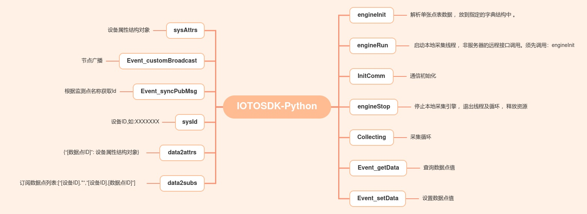

# IOTOSDK-Python

> 支持集群和单机部署；支持跨平台和多语言SDK；支持同步回调；功能兼具采集平台、通信中台、数据中台

#### 产品介绍
    IOTOS Python版本SDK，自带原生接口和采集引擎
* 驱动套件包含采集引擎和驱动，其中采集引擎由ZMIotLib库和iotosEngine进程构成；驱动则包含驱动类IOTOSDriverI，和用户基于此开发的扩展包。
* iotosEngine进程是整个采集引擎的启动入口，负责与平台通讯以及动态实例化加载驱动。用户进行设备对接、系统集成、服务扩展，只需要在驱动类基础上，开发扩展包即可，开发时配合WEB控制台进行设备建模、数据点表配置。

### 产品使用文档
* 开发使用入门介绍[http://docs.aiotos.net/docs/iotos/iotos-1db95bnmleg6f](http://docs.aiotos.net/docs/iotos/iotos-1db95bnmleg6f)
* 开发使用接口手册文档[http://docs.aiotos.net/docs/iotos/iotos-1db95c6h4k2ee](http://docs.aiotos.net/docs/iotos/iotos-1db95c6h4k2ee)
* WEB控制台的使用[http://docs.aiotos.net/docs/iotos/iotos-1db958kji7ki5](http://docs.aiotos.net/docs/iotos/iotos-1db958kji7ki5)
* 设备驱动代码示例[http://docs.aiotos.net/docs/iotos/iotos-1db95el2hk8ij](http://docs.aiotos.net/docs/iotos/iotos-1db95el2hk8ij)
* 驱动开发常见问题[http://docs.aiotos.net/docs/iotos/iotos-1dbo0c8komrfo](http://docs.aiotos.net/docs/iotos/iotos-1dbo0c8komrfo)

#### 软件架构

#### 环境
	版本兼容 Python2 和 Python3 

#### 安装教程

1.  Fork本仓库
2.  下拉Fork仓库中的代码到本地
3.  配置Python环境，安装需要的模块[requirements.txt](requirements.txt)

#### 使用说明
每个子项目都可以单独运行，需要事先在WEB控制台台中创建对应的设备,设备实例,通信网关,数据点。方可将采集到的数据传输到WEB控制台
1.  在WEB控制台[http://sys.aiotos.net/](http://sys.aiotos.net/)配置好设备,设备实例,通信网关,数据点
2.  根据开发文档[http://docs.aiotos.net/docs/iotos/iotos-1db95el2hk8ij](http://docs.aiotos.net/docs/iotos/iotos-1db95el2hk8ij)编写SDK驱动。
3.  运行使用后即可将数据丢到WEB控制台

